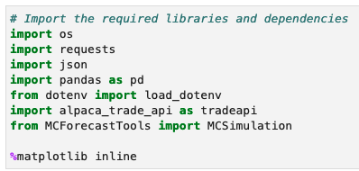
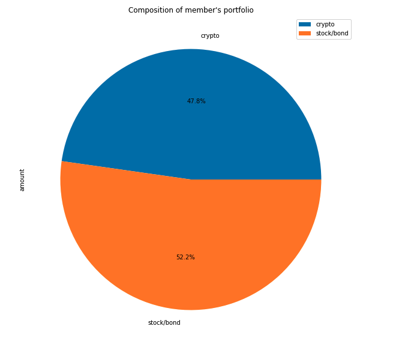
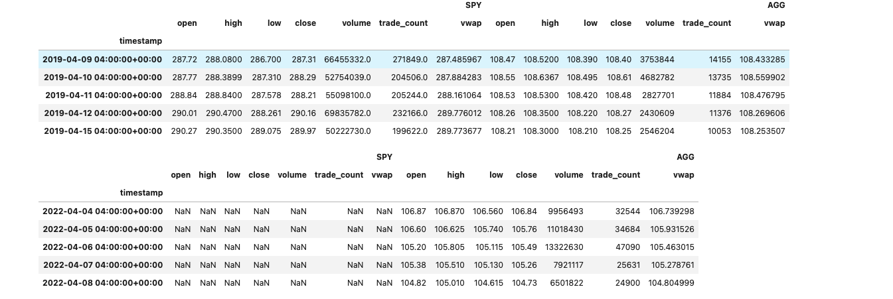
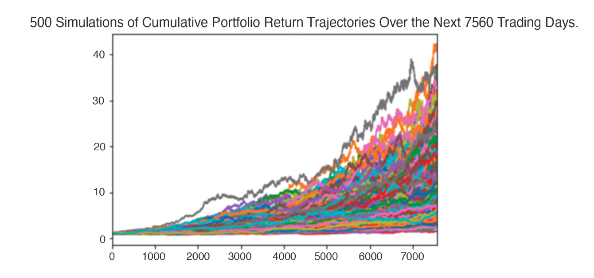

# Week-5-Challange-Financial-planning-tools
The application utilizes API to access financial data to analyze and simulate scenarios to better plan portfolio consisting of crypto, stocks, and bond.

## What the application does? 

The application accesses the current financial data related to cryptocurrenies, stocks, and bond market using API functions. The application is capable of narrowing down to nitty gritty details to the broad scope of different financial market. Moreover, the data is very current making the estimations very accurate and real as possible. Similarly, the application also allows using Monte Carlo simulation to scrutinize risk factors under different scenarios. 

In the application we have a scenario where we are a fintech consulting firm trying to estimate retirement portfolios of people/members of a credit union. The members hold assests and investments in the form of cryptocurrencies, Stock ETFs and Bond ETFs. We stress test the portfolio under different circumstanmces and also make an forecast based on 10-year and 30-year periods.

---

## Technology used:

The application was written in development mode using Annoconda, Python as programming language, and written on a Jupyter Notebook. 

On the other hand, the application uses API supported by Alpaca, and simulations made possible using Monte Carlo technology. 

Highlights of functions and libraries necessary for aaopertaion of the application is given below:

APIs from Alpaca can be acquired by signing up on their site. The link is given below:
<E>

[alpaca sign up link](https://app.alpaca.markets/signup)

</E>

## Calculations:
 Using the application was managed to calculate different financial figures to gain more clarity on financial future of the members of the credit union
 
 
Portfolio composition:

 
 
 
 
Historical data:

Simulation:

